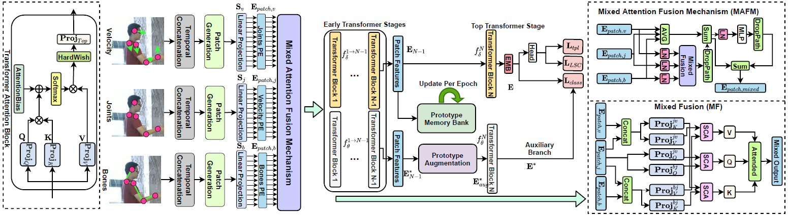

# Trans4SOAR: Delving Deep into One-Shot Skeleton-based Action Recognition with Diverse Occlusions

## Introduction of our work
In this work, we focus on skeleton-based one-shot action recognition with diverse occlusion scenarios. In order to get the realistic synthesized occluded dataset for NTU-120, NTU-60 and Toyota Smart Home, please send the license agreement of the original datasets to pengkunyu1013@gmail.com. After checking the datasets will be sent via email. Thank you for your interests!

## Environment
The required packages are listed in the environment.yml, please create conda env accordingly.

## Dataloader
The dataloaders can be found in the dataloader folder, before the running of the code please change the corresponding path accordingly in the dataloader.

## How to run the code
 First, execute,
 export DATASET_FOLDER="$(pwd)/data"
 Then, python train_original.py
 If you are using Trans4SOAR model please make sure you use one gpu for training.

